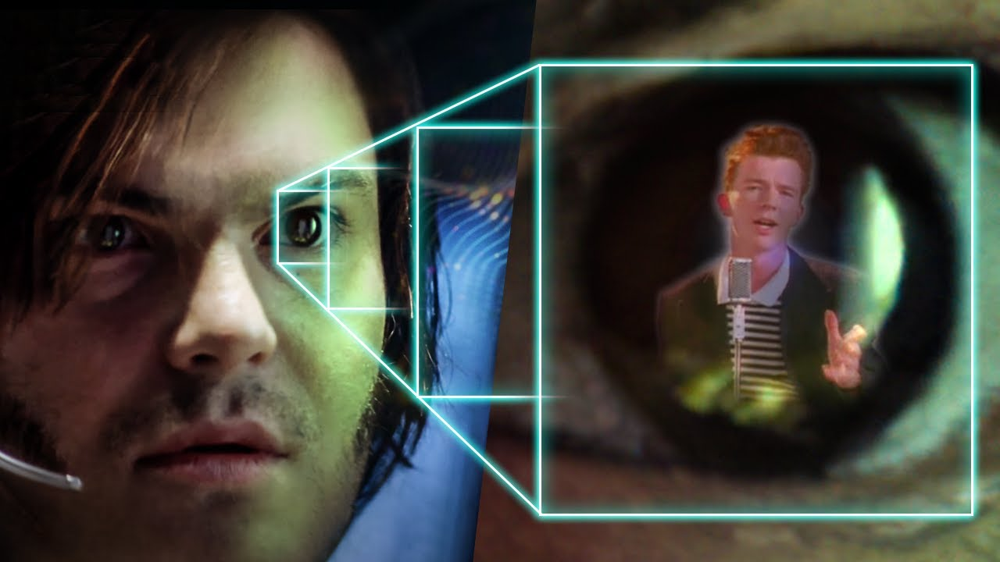
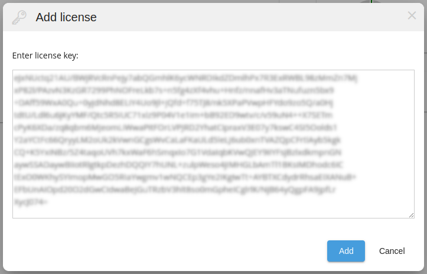
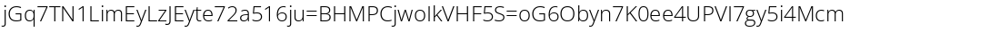
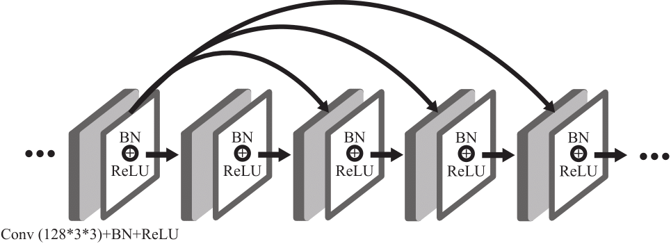

# Pixels and Secrets: Unmasking Blurred Text with Neural Networks



## Introduction

We've all seen it - documentation with screenshots where sensitive information is blurred out. Most of us just accept it and move on. But I got curious: how secure is blurring as a redaction method? Could those pixels be unscrambled?
This writeup chronicles my experiment where I tried to recover deliberately obscured text using neural networks. It's part technical challenge, part security exploration, and maybe a wake-up call about common "security" practices.

## The Mystery Begins

While reading through some admin documentation, I noticed something interesting in the licensing section. There was a helpful guide explaining how to add a license key, complete with a screenshot - but the actual key in the image was blurred out.



I stared at it for a minute, wondering: is blurring actually secure, or just an illusion of security?

## The Quest

Rather than just speculate, I decided to test it myself. I started the DeepTextDeblur project, inspired by [DeepDeblur](https://github.com/meijianhan/DeepDeblur) but with a narrower focus on recovering text.
The concept isn't complicated: train a neural network to learn the relationship between blurred text and clear text, then see if it can reverse-engineer the blurring process.

## The Approach

### 1. Data Generation

My first challenge was getting enough training data. I wrote a script that:

- Creates random license keys matching the pattern I needed to recover
- Renders them as clean images
- Applies Gaussian blur to create matched sharp/blurred pairs




### 2. The Neural Network

For the model architecture, I went with a modified U-Net with some attention mechanisms tailored for text:

```python
# The heart of our deblurring network
# (Not the actual implementation, just illustrating the concept)
def build_deblur_model():
    inputs = Input(shape=(None, None, 3))
    
    # Encoder path
    conv1 = Conv2D(64, 3, activation='relu', padding='same')(inputs)
    # ... more layers ...
    
    # Decoder with skip connections
    up1 = concatenate([UpSampling2D()(conv4), conv3])
    # ... more layers ...
    
    outputs = Conv2D(3, 3, activation='sigmoid', padding='same')(up2)
    
    return Model(inputs, outputs)
```


This model learns to map blurred images back to their sharp counterparts.

### 3. Training Adventures

Training neural networks is always a mix of patience and tweaking. Each epoch took around 10-15 minutes on my GPU:

```
Epoch 1/100
Loss: 0.4827 - Accuracy: 0.2145
Epoch 2/100
Loss: 0.3912 - Accuracy: 0.3567
...
Epoch 47/100
Loss: 0.0823 - Accuracy: 0.9134
...
Epoch 100/100
Loss: 0.0312 - Accuracy: 0.9678
```

I'd check in periodically between other tasks, watching random pixel noise gradually transform into recognizable letters and numbers. The process reminded me of old darkroom photography, where an image slowly emerges in the developing tray.

## The Reveal

After training, I tested the model on the actual blurred license key from the documentation:


It worked better than I expected. The recovered text wasn't perfect, but it was clear enough to read the license key format and most of the characters. With a bit of common sense to fill in the gaps, the full key was recoverable.

## Beyond Deblurring: A Deeper Dive

While recovering the text was fun, I wondered if there was a more direct approach. Using tools like a Python bytecode decompiler and an HTTPS proxy, it became clear that the real solution wasn't about breaking the blur - it was about understanding the underlying system.

Without going into specifics that might compromise any systems, I discovered that with the right understanding of the communication protocol, one could theoretically:
- Intercept license verification requests
- Modify DNS to point to a custom server
- Create responses that would satisfy the verification process
- Even replace compiled `.pyc` files with modified versions that bypass license validation entirely

## Conclusion

This experiment was more than just a technical exercise - it was a reality check on common security practices. Blurring text in screenshots isn't true redaction; it's more like security through mild inconvenience.

## Technical Implementation

If you want to try DeepTextDeblur yourself, here's how to get started:

### Directory Structure

```
DeepTextDeblur/
├── data/
│   ├── blur/                 # Folder with blurred text images
│   └── sharp/                # Folder with corresponding sharp text images
├── train.py                  # Training script for the deblurring network
├── run.py                    # Inference script for deblurring a single image
├── model.py                  # Neural network model definition and architecture
├── generate.py               # Text image generation utility
├── blur_parallel.sh          # Parallel blurring utility using GIMP
└── README.md                 # Project documentation
```

### Installation

Getting started with DeepTextDeblur is straightforward:

```bash
# Clone the repository
git clone https://github.com/gritskevich/DeepTextDeblur.git
cd DeepTextDeblur

# Set up a virtual environment
python3 -m venv venv
source venv/bin/activate

# Install dependencies
pip install -r requirements.txt
```

### Dataset Creation

The power of this project comes from its ability to generate synthetic training data that closely resembles real-world scenarios.

#### 1. Generate Sharp Text Images

The first step is to create clear text images that will serve as the ground truth:

```bash
python generate.py
```

This script randomly generates text samples that mimic license keys and other structured text formats, rendering them as high-quality images.

#### 2. Create Blurred Counterparts

After generating the sharp images, we need to create realistic blur effects:

```bash
./blur_parallel.sh
```

This script utilizes GIMP's professional-grade Gaussian blur filter and GNU Parallel to efficiently process all images.

### Prerequisites for Blurring

- **GIMP**: Professional image manipulation program
  - Ubuntu/Debian: `sudo apt-get install gimp`
  - macOS: `brew install --cask gimp` 
  - Windows: Download from [GIMP website](https://www.gimp.org/downloads/)

- **GNU Parallel**: Tool for parallel processing
  - Ubuntu/Debian: `sudo apt-get install parallel`
  - macOS: `brew install parallel`
  - Windows: Available via WSL

### Training the Model

Once your dataset is prepared, training the neural network is a single command:

```bash
python train.py
```

This process:
1. Splits your dataset (80% training, 20% validation)
2. Initializes the U-Net architecture with attention mechanisms
3. Trains the model, saving checkpoints along the way
4. Outputs the final model as `deblur_net.pth`

Each training run typically takes several minutes on a modern GPU, with noticeable improvements in quality after about 30 epochs.

### Running Inference

After training, you can deblur new images using:

```bash
python run.py input_blurred.png output_deblurred.png
```

### Neural Network Architecture

The heart of DeepTextDeblur is a modified U-Net architecture optimized specifically for text recovery:

Key architectural features include:
- **Skip connections** that preserve spatial information across the network
- **Deep encoder-decoder structure** for progressive feature extraction and reconstruction
- **Attention mechanisms** that help focus on text regions
- **Specialized convolution blocks** designed for recovering fine text details

> *Special thanks to OpenAI's o3-mini-high for suggesting these architectural features 🤖✨*

## Acknowledgments

This project builds upon the foundational work of [DeepDeblur](https://github.com/meijianhan/DeepDeblur) and related research in the field of image deblurring. The modifications made focus specifically on optimizing for text recovery rather than general image deblurring.

---

*Disclaimer: This project was created for educational purposes. The techniques described should not be used to access information you don't have permission to view. Always respect privacy and security boundaries.*
